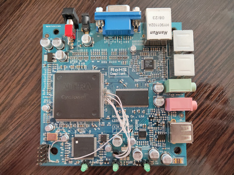

## What is this?
This is project of reverse engineering Ncompunting L230 PCB (rev 1.4).

## What is there?
* *cpld/* - template for CPLD firmware for Quartus
* *fpga/* - template for FPGA firmware for Quartus
* *pcb/*- simplified schematic in Kicad format
* *doc/*- some datasheets for used chips

## Main chips
* FPGA: EP1C12Q240C8N
* CPLD: EPM3128ATC100-10N
* Flash: AT45DB041B
* SDRAM: IS42S32400D-7TL
* Ethernet: RTL8201CL
* Audio input: PCM1808
* Audio output amplifier: LM358

## Programming
Programming header J1 have this pinout:

| # | Pin    | Function |
| - | -      | -        |
| 1 | MAX-62 | TCK      |
| 2 | MAX-73 | TDO	    |
| 3 | MAX-15 | TMS	    |
| 4 | -      | GND      |
| 5 | MAX-4  | TDI	    |

To program FPGA on-the-fly you need:
1. Cut MAX-73 to J1-2 trace;
2. Connect MAX-73 to CY-155;
3. Connect CY-147 to J1-1;
4. Connect CY-149 to J1-2;
5. Connect CY-148 to J1-3.
